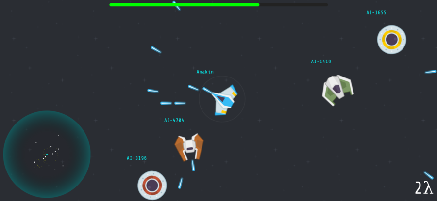

# shooter.io



[shooter.io][1] is a network based multiplayer space shooter game.

## shooter-server

`shooter-server` is a Go program that runs a universe for space ships that can
shoot and destroy each other.

It also accepts incoming websockets connections, assigns each connection its
own ship, and lets the user control her ship.

You can build and run the server with:

```
make docker-run
```

## shooter-html5

The [shooter-html5][2] repo is a HTML5 client that uses canvas, JavaScript and
Websockets to display whatever is happening on `shooter-server`.

## Current state

* This project was never finished, code is messy, racy and undocumented. I
  don't have plans to continue working on this again anytime soon...
* I'd like to create a native client for mobile too.
* I'd like to experiment with UDP messages instead of TCP websockets.

## License

> Copyright 2014-today José Carlos Nieto
>
> Licensed under the Apache License, Version 2.0 (the "License");
> you may not use this file except in compliance with the License.
> You may obtain a copy of the License at
>
>     http:>www.apache.org/licenses/LICENSE-2.0
>
> Unless required by applicable law or agreed to in writing, software
> distributed under the License is distributed on an "AS IS" BASIS,
> WITHOUT WARRANTIES OR CONDITIONS OF ANY KIND, either express or implied.
> See the License for the specific language governing permissions and
> limitations under the License.

[1]: https://shooter.io
[2]: https://github.com/xiam/shooter-html5
[3]: https://github.com/xiam/shooter-vagrant
